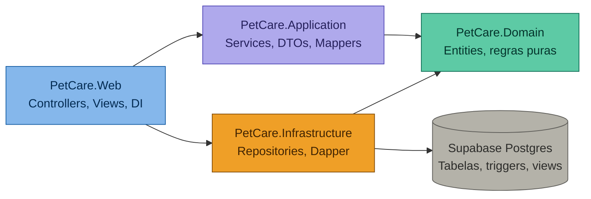
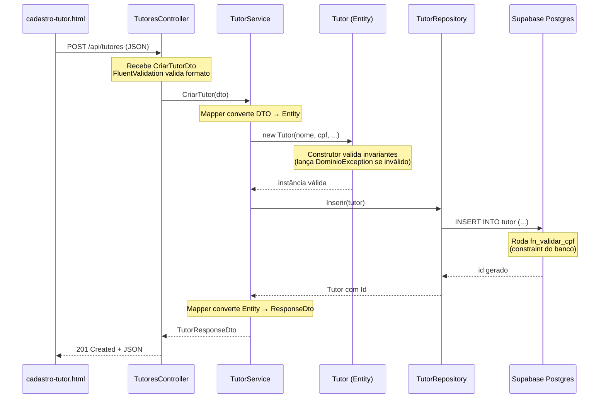
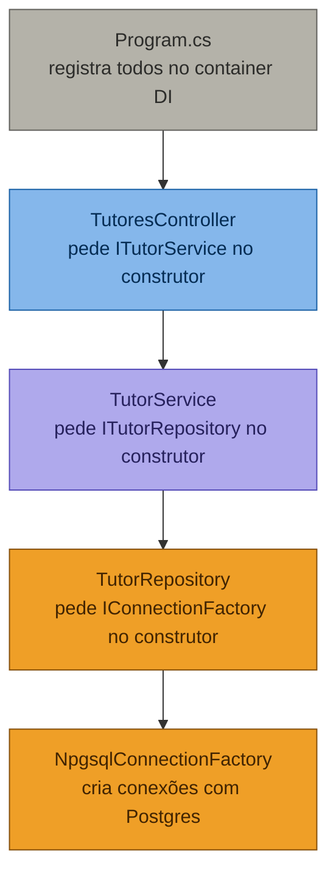
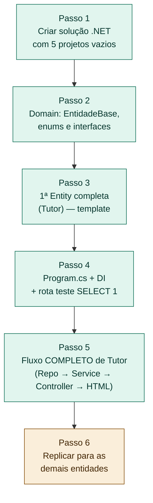

# 🏗️ Arquitetura do Sistema — PetCare Goiânia

> **Documento de referência arquitetural do projeto.**  
> Este arquivo define a estrutura, responsabilidades e regras invioláveis da arquitetura do back-end em C#/ASP.NET Core integrado ao Supabase (PostgreSQL).
>
> **Stack:** ASP.NET Core 8 · Npgsql + Dapper · Supabase Postgres · HTML5/CSS3/JS  
> **Padrão arquitetural:** Clean Architecture (4 camadas)  
> **Última atualização:** Sprint 2 — PIM III / UNIP

---

## 📑 Sumário

1. [Visão de alto nível](#1-visão-de-alto-nível)
2. [Estrutura de pastas](#2-estrutura-de-pastas)
3. [Responsabilidades de cada camada](#3-responsabilidades-de-cada-camada)
4. [Por que Dapper?](#4-por-que-dapper)
5. [Fluxo de uma requisição](#5-fluxo-de-uma-requisição-ponta-a-ponta)
6. [As 5 regras invioláveis](#6-as-5-regras-invioláveis)
7. [Dependency Injection](#7-dependency-injection--como-tudo-se-conecta)
8. [Validação em duas camadas](#8-validação-em-duas-camadas)
9. [Tratamento de erros](#9-tratamento-de-erros)
10. [Próximos passos](#10-próximos-passos)
11. [Glossário rápido](#11-glossário-rápido-vindo-de-react)

---

## 1. Visão de alto nível

A arquitetura segue o padrão **Clean Architecture** com 4 camadas. A regra fundamental é a **direção das dependências**: cada camada só pode olhar "para dentro", nunca "para fora". O `Domain` é o núcleo — ele não depende de nada.



**Leitura:** cada seta significa _"depende de"_. O `Domain` não tem setas saindo dele — é o núcleo do sistema. Trocar o banco de Postgres para SQL Server, por exemplo, afetaria apenas `Infrastructure`. As regras de negócio ficam intactas.

---

## 2. Estrutura de pastas

```
PetCareApp/
│
├── PetCare.sln
│
├── src/
│   ├── PetCare.Domain/                  ← Núcleo. Não depende de nada.
│   │   ├── Entities/
│   │   │   ├── Base/
│   │   │   │   └── EntidadeBase.cs      ← Id, CreatedAt
│   │   │   ├── Pessoas/
│   │   │   │   ├── Tutor.cs
│   │   │   │   └── Veterinario.cs
│   │   │   ├── Animais/
│   │   │   │   ├── Animal.cs
│   │   │   │   ├── Especie.cs
│   │   │   │   └── Raca.cs
│   │   │   ├── Atendimento/
│   │   │   │   ├── Agendamento.cs
│   │   │   │   ├── Prontuario.cs
│   │   │   │   └── HistoricoClinico.cs
│   │   │   ├── Estoque/
│   │   │   │   ├── Produto.cs
│   │   │   │   └── MovimentacaoEstoque.cs
│   │   │   ├── Vendas/
│   │   │   │   ├── Venda.cs
│   │   │   │   └── ItemVenda.cs
│   │   │   └── Comunicacao/
│   │   │       └── LembreteEnviado.cs
│   │   ├── Enums/
│   │   │   ├── StatusAgendamento.cs     ← AGENDADO/CANCELADO/CONCLUIDO
│   │   │   ├── TipoMovimentacao.cs      ← ENTRADA/SAIDA
│   │   │   ├── TipoLembrete.cs          ← CONSULTA/VACINA
│   │   │   ├── MeioEnvio.cs             ← EMAIL/WHATSAPP
│   │   │   ├── StatusEnvio.cs           ← ENVIADO/FALHA
│   │   │   └── Sexo.cs                  ← M/F
│   │   ├── Interfaces/
│   │   │   └── Repositories/
│   │   │       ├── IRepositorioBase.cs
│   │   │       ├── ITutorRepository.cs
│   │   │       ├── IAnimalRepository.cs
│   │   │       ├── IVeterinarioRepository.cs
│   │   │       ├── IAgendamentoRepository.cs
│   │   │       ├── IProntuarioRepository.cs
│   │   │       ├── IProdutoRepository.cs
│   │   │       ├── IMovimentacaoEstoqueRepository.cs
│   │   │       └── IVendaRepository.cs
│   │   └── Exceptions/
│   │       ├── DominioException.cs      ← Base de todas
│   │       ├── ConflitoAgendamentoException.cs
│   │       ├── EstoqueInsuficienteException.cs
│   │       └── EntidadeNaoEncontradaException.cs
│   │
│   ├── PetCare.Application/             ← Depende SÓ de Domain
│   │   ├── DTOs/
│   │   │   ├── Tutor/
│   │   │   │   ├── CriarTutorDto.cs
│   │   │   │   ├── AtualizarTutorDto.cs
│   │   │   │   └── TutorResponseDto.cs
│   │   │   ├── Animal/
│   │   │   ├── Agendamento/
│   │   │   ├── Prontuario/
│   │   │   ├── Produto/
│   │   │   ├── Venda/
│   │   │   └── Comum/
│   │   │       └── EnderecoDto.cs       ← reusado
│   │   ├── Services/
│   │   │   ├── Interfaces/
│   │   │   │   ├── ITutorService.cs
│   │   │   │   └── IAgendamentoService.cs
│   │   │   ├── TutorService.cs
│   │   │   ├── AnimalService.cs
│   │   │   ├── VeterinarioService.cs
│   │   │   ├── AgendamentoService.cs    ← validação de conflito (RF04)
│   │   │   ├── ProntuarioService.cs
│   │   │   ├── ProdutoService.cs
│   │   │   ├── EstoqueService.cs
│   │   │   └── VendaService.cs
│   │   ├── Mappers/
│   │   │   ├── TutorMapper.cs
│   │   │   ├── AnimalMapper.cs
│   │   │   └── AgendamentoMapper.cs
│   │   └── Validators/                  ← FluentValidation
│   │       ├── CriarTutorValidator.cs
│   │       ├── CriarAnimalValidator.cs
│   │       └── CriarAgendamentoValidator.cs
│   │
│   ├── PetCare.Infrastructure/          ← Depende de Domain
│   │   ├── Data/
│   │   │   ├── IConnectionFactory.cs
│   │   │   ├── NpgsqlConnectionFactory.cs
│   │   │   └── DapperSetup.cs           ← snake_case → PascalCase
│   │   ├── Repositories/
│   │   │   ├── RepositorioBase.cs       ← CRUD genérico com Dapper
│   │   │   ├── TutorRepository.cs
│   │   │   ├── AnimalRepository.cs
│   │   │   ├── VeterinarioRepository.cs
│   │   │   ├── AgendamentoRepository.cs
│   │   │   ├── ProntuarioRepository.cs
│   │   │   ├── ProdutoRepository.cs
│   │   │   ├── MovimentacaoEstoqueRepository.cs
│   │   │   └── VendaRepository.cs
│   │   └── Configuration/
│   │       └── SupabaseSettings.cs
│   │
│   └── PetCare.API/                     ← Depende de Application + Infrastructure
│       ├── Controllers/
│       │   ├── TutoresController.cs
│       │   ├── AnimaisController.cs
│       │   ├── VeterinariosController.cs
│       │   ├── AgendamentosController.cs
│       │   ├── ProntuariosController.cs
│       │   ├── ProdutosController.cs
│       │   ├── EstoqueController.cs
│       │   ├── VendasController.cs
│       │   └── DashboardController.cs
│       ├── Middleware/
│       │   └── TratamentoErrosMiddleware.cs
│       ├── Config/
│       │   ├── DependencyInjectionConfig.cs
│       │   └── SwaggerConfig.cs
│       ├── wwwroot/                     ← FRONT-END
│       │   ├── index.html
│       │   ├── pages/
│       │   ├── css/
│       │   └── js/
│       ├── appsettings.json
│       └── Program.cs
│
└── tests/
    └── PetCare.Tests/
        ├── Domain/
        └── Application/
```

---

## 3. Responsabilidades de cada camada

| Camada | Pode fazer | NÃO pode fazer |
|---|---|---|
| **Domain** | Definir entidades, enums, regras invariantes (no construtor) | Conhecer Postgres, HTTP, JSON, DTO, Dapper |
| **Application** | Orquestrar Services, validar DTOs, mapear DTO ↔ Entity | Saber qual SGBD é usado, escrever SQL, conhecer ASP.NET |
| **Infrastructure** | Implementar repositórios, abrir conexão, executar SQL via Dapper | Conter regras de negócio, retornar DTOs |
| **API** | Receber HTTP, chamar Service, devolver JSON, servir HTML | Acessar repositório direto, conter lógica de negócio |

### 3.1 Tabela de decisão rápida

Cole isto impresso ao lado do monitor. Antes de escrever qualquer arquivo, responda:

| Pergunta antes de escrever código | Onde mora |
|---|---|
| Vou validar regra de negócio (ex: data nascimento < hoje)? | **Domain** (construtor) |
| Vou converter `CriarTutorDto` em `Tutor`? | **Application** (Mapper) |
| Vou orquestrar várias operações (criar venda + dar baixa no estoque)? | **Application** (Service) |
| Vou escrever SQL? | **Infrastructure** (Repository) |
| Vou abrir conexão com Postgres? | **Infrastructure** (ConnectionFactory) |
| Vou retornar JSON HTTP? | **API** (Controller) |
| Vou servir HTML/CSS/JS? | **API/wwwroot** |

---

## 4. Por que Dapper?

Dapper é uma biblioteca de **micro-ORM** que fica em cima do Npgsql. Ela elimina o boilerplate de leitura de `DataReader` mas mantém o SQL puro nas suas mãos.

### Comparação: buscar tutor por ID

**Sem Dapper (Npgsql cru):**

```csharp
public async Task<Tutor?> ObterPorId(long id)
{
    using var conn = new NpgsqlConnection(_connectionString);
    await conn.OpenAsync();

    using var cmd = new NpgsqlCommand(
        "SELECT id, nome, cpf, email FROM tutor WHERE id = @id", conn);
    cmd.Parameters.AddWithValue("@id", id);

    using var reader = await cmd.ExecuteReaderAsync();
    if (!await reader.ReadAsync()) return null;

    return new Tutor
    {
        Id = reader.GetInt64(0),
        Nome = reader.GetString(1),
        Cpf = reader.GetString(2),
        Email = reader.GetString(3)
    };
}
```

**Com Dapper:**

```csharp
public async Task<Tutor?> ObterPorId(long id)
{
    using var conn = _factory.CreateConnection();
    return await conn.QueryFirstOrDefaultAsync<Tutor>(
        "SELECT id, nome, cpf, email FROM tutor WHERE id = @id",
        new { id });
}
```

### Vantagens para o PIM

- **SQL continua escrito por você** (atende o Card #12 — descrição das consultas SQL)
- **Triggers e funções do banco continuam ativas** (`fn_validar_cpf`, `trg_atualizar_estoque`, views)
- **Curva de aprendizado mínima** — quatro métodos resolvem 95% dos casos: `Query`, `QueryFirstOrDefault`, `Execute`, `ExecuteScalar`
- **Performance excelente** — Dapper é uma das libs mais rápidas do .NET

### Pacotes NuGet necessários

```bash
# No projeto PetCare.Infrastructure
dotnet add package Npgsql
dotnet add package Dapper
```

### Mapeamento snake_case ↔ PascalCase

O Postgres usa `snake_case` (`data_consulta`, `tutor_id`), mas C# usa `PascalCase` (`DataConsulta`, `TutorId`). O Dapper resolve isso com uma configuração global:

```csharp
// PetCare.Infrastructure/Data/DapperSetup.cs
public static class DapperSetup
{
    public static void Configure()
    {
        Dapper.DefaultTypeMap.MatchNamesWithUnderscores = true;
    }
}
```

Chame `DapperSetup.Configure()` uma vez no `Program.cs`.

---

## 5. Fluxo de uma requisição (ponta a ponta)

Exemplo: o usuário cria um tutor pelo formulário HTML.



### Tradução em código (visão simplificada)

```csharp
// 1. CONTROLLER (PetCare.API/Controllers)
[ApiController]
[Route("api/tutores")]
public class TutoresController(ITutorService service) : ControllerBase
{
    [HttpPost]
    public async Task<IActionResult> Criar(CriarTutorDto dto)
    {
        var resultado = await service.CriarTutor(dto);
        return CreatedAtAction(nameof(ObterPorId), new { id = resultado.Id }, resultado);
    }

    [HttpGet("{id}")]
    public async Task<IActionResult> ObterPorId(long id)
        => Ok(await service.ObterPorId(id));
}

// 2. SERVICE (PetCare.Application/Services)
public class TutorService(ITutorRepository repo) : ITutorService
{
    public async Task<TutorResponseDto> CriarTutor(CriarTutorDto dto)
    {
        var tutor = TutorMapper.DtoParaEntity(dto);
        var inserido = await repo.Inserir(tutor);
        return TutorMapper.EntityParaResponse(inserido);
    }
}

// 3. ENTITY (PetCare.Domain/Entities/Pessoas)
public class Tutor : EntidadeBase
{
    public string Nome { get; private set; }
    public string Cpf { get; private set; }

    protected Tutor() { } // Dapper precisa de construtor sem parâmetros

    public Tutor(string nome, string cpf, string email)
    {
        if (string.IsNullOrWhiteSpace(nome))
            throw new DominioException("Nome é obrigatório.");
        Nome = nome;
        Cpf = cpf;
    }
}

// 4. REPOSITORY (PetCare.Infrastructure/Repositories)
public class TutorRepository(IConnectionFactory factory) : ITutorRepository
{
    public async Task<Tutor> Inserir(Tutor tutor)
    {
        using var conn = factory.CreateConnection();
        var id = await conn.ExecuteScalarAsync<long>(@"
            INSERT INTO tutor (nome, cpf, email, telefone, rua, numero, bairro, cidade, estado)
            VALUES (@Nome, @Cpf, @Email, @Telefone, @Rua, @Numero, @Bairro, @Cidade, @Estado)
            RETURNING id", tutor);

        return await ObterPorId(id) ?? throw new InvalidOperationException();
    }

    public async Task<Tutor?> ObterPorId(long id)
    {
        using var conn = factory.CreateConnection();
        return await conn.QueryFirstOrDefaultAsync<Tutor>(
            "SELECT * FROM tutor WHERE id = @id", new { id });
    }
}
```

---

## 6. As 5 regras invioláveis

Estas regras, se seguidas desde o primeiro arquivo, evitam 90% dos erros estruturais.

### Regra 1 — Domain não conhece DTO

❌ **Errado:**
```csharp
// PetCare.Domain/Entities/Tutor.cs
public Tutor(CriarTutorDto dto) { ... }  // Domain importando Application!
```

✅ **Certo:**
```csharp
public Tutor(string nome, string cpf, string email) { ... }
```

> O **Mapper** (na camada Application) é a ponte entre DTO e Entity.

### Regra 2 — Service não escreve SQL

❌ **Errado:**
```csharp
// PetCare.Application/Services/TutorService.cs
var sql = "INSERT INTO tutor ...";  // SQL na Application!
```

✅ **Certo:**
```csharp
await _repository.Inserir(tutor);
```

> SQL mora **somente** em `Repository` (Infrastructure).

### Regra 3 — Controller é burro de propósito

❌ **Errado:**
```csharp
if (dto.Cpf.Length != 11) return BadRequest();
if (await _repo.ExisteCpf(dto.Cpf)) return Conflict();
```

✅ **Certo:**
```csharp
var resultado = await _service.CriarTutor(dto);
return Created(resultado);
```

> Sem `if` de regra de negócio no Controller. Toda lógica vai para Service ou Entity.

### Regra 4 — Validação acontece em duas camadas

| Onde | O que valida | Exemplo |
|---|---|---|
| **Application** (FluentValidation) | **Formato** dos dados de entrada | "CPF tem 11 dígitos?", "email tem `@`?" |
| **Domain** (construtor) | **Invariantes** de regra de negócio | "Animal não pode nascer no futuro", "peso > 0" |

> Não confunda. Formato é validação de entrada (DTO). Invariante é regra do mundo real (Entity).

### Regra 5 — Repository retorna Entity, nunca DTO

❌ **Errado:**
```csharp
public async Task<TutorResponseDto> ObterPorId(long id) { ... }
```

✅ **Certo:**
```csharp
public async Task<Tutor?> ObterPorId(long id) { ... }
```

> Quem converte para DTO é o **Service**, antes de devolver para o Controller.

---

## 7. Dependency Injection — como tudo se conecta

Em React você importa o que precisa: `import { useState } from 'react'`. Em ASP.NET Core, você **registra** as classes uma vez no `Program.cs` e o framework **injeta** elas automaticamente nos construtores.

### Configuração (uma única vez)

```csharp
// Program.cs
var builder = WebApplication.CreateBuilder(args);

DapperSetup.Configure();  // snake_case ↔ PascalCase

// Infrastructure
builder.Services.AddSingleton<IConnectionFactory, NpgsqlConnectionFactory>();
builder.Services.AddScoped<ITutorRepository, TutorRepository>();
builder.Services.AddScoped<IAnimalRepository, AnimalRepository>();
builder.Services.AddScoped<IAgendamentoRepository, AgendamentoRepository>();

// Application
builder.Services.AddScoped<ITutorService, TutorService>();
builder.Services.AddScoped<IAgendamentoService, AgendamentoService>();

// Validators (FluentValidation)
builder.Services.AddValidatorsFromAssemblyContaining<CriarTutorValidator>();

// API
builder.Services.AddControllers();
builder.Services.AddSwaggerGen();

var app = builder.Build();

app.UseMiddleware<TratamentoErrosMiddleware>();
app.UseStaticFiles();      // serve wwwroot/
app.UseDefaultFiles();     // serve index.html automaticamente
app.MapControllers();
app.Run();
```

### O ciclo de vida

| Lifetime | Quando usar |
|---|---|
| `Singleton` | Configurações estáticas (`ConnectionFactory`) |
| `Scoped` | A cada requisição HTTP, uma nova instância (Services, Repositories) |
| `Transient` | Nova instância sempre que injetada (raramente necessário) |

### Fluxo de injeção visual



> Cada peça só conhece a **interface**, nunca a implementação concreta.

---

## 8. Validação em duas camadas

### Camada Application — FluentValidation (formato)

```csharp
public class CriarTutorValidator : AbstractValidator<CriarTutorDto>
{
    public CriarTutorValidator()
    {
        RuleFor(x => x.Nome).NotEmpty().MaximumLength(255);
        RuleFor(x => x.Cpf).NotEmpty().Length(11).Matches(@"^\d{11}$");
        RuleFor(x => x.Email).NotEmpty().EmailAddress();
        RuleFor(x => x.Telefone).NotEmpty().MaximumLength(20);
    }
}
```

### Camada Domain — invariantes no construtor

```csharp
public Tutor(string nome, string cpf, string email)
{
    if (string.IsNullOrWhiteSpace(nome))
        throw new DominioException("Nome é obrigatório.");
    if (string.IsNullOrWhiteSpace(cpf) || cpf.Length != 11)
        throw new DominioException("CPF inválido.");

    Nome = nome;
    Cpf = cpf;
}
```

### Camada Postgres — constraints e funções

```sql
-- Já existe no schema
CONSTRAINT chk_cpf_valido CHECK (fn_validar_cpf(cpf))
```

> **Defense in depth** — múltiplas barreiras protegem a integridade dos dados.

---

## 9. Tratamento de erros

### Hierarquia de exceções no Domain

```csharp
public class DominioException : Exception
{
    public DominioException(string mensagem) : base(mensagem) { }
}

public class ConflitoAgendamentoException : DominioException
{
    public ConflitoAgendamentoException(DateTime dataHora, long veterinarioId)
        : base($"Já existe agendamento em {dataHora:dd/MM/yyyy HH:mm} para o veterinário {veterinarioId}.") { }
}

public class EntidadeNaoEncontradaException : DominioException
{
    public EntidadeNaoEncontradaException(string entidade, long id)
        : base($"{entidade} com id {id} não encontrado.") { }
}

public class EstoqueInsuficienteException : DominioException
{
    public EstoqueInsuficienteException(long produtoId, int solicitado, int disponivel)
        : base($"Estoque insuficiente do produto {produtoId}: solicitado {solicitado}, disponível {disponivel}.") { }
}
```

### Middleware captura tudo e devolve JSON consistente

```csharp
public class TratamentoErrosMiddleware(RequestDelegate next)
{
    public async Task InvokeAsync(HttpContext context)
    {
        try
        {
            await next(context);
        }
        catch (EntidadeNaoEncontradaException ex)
        {
            context.Response.StatusCode = 404;
            await context.Response.WriteAsJsonAsync(new { erro = ex.Message });
        }
        catch (ConflitoAgendamentoException ex)
        {
            context.Response.StatusCode = 409;
            await context.Response.WriteAsJsonAsync(new { erro = ex.Message });
        }
        catch (DominioException ex)
        {
            context.Response.StatusCode = 400;
            await context.Response.WriteAsJsonAsync(new { erro = ex.Message });
        }
        catch (Exception)
        {
            context.Response.StatusCode = 500;
            await context.Response.WriteAsJsonAsync(new { erro = "Erro interno do servidor." });
        }
    }
}
```

### Mapeamento de status HTTP

| Exceção | Status | Significado |
|---|---|---|
| `EntidadeNaoEncontradaException` | 404 | Not Found |
| `ConflitoAgendamentoException` | 409 | Conflict |
| `DominioException` (genérica) | 400 | Bad Request |
| `Exception` (não tratada) | 500 | Internal Server Error |

---

## 10. Próximos passos

A ordem recomendada de implementação:



### Checklist Passo 1 — Criar a solução

```bash
# Na raiz do repositório
dotnet new sln -n PetCare

# Criar os projetos
dotnet new classlib -n PetCare.Domain         -o src/PetCare.Domain
dotnet new classlib -n PetCare.Application    -o src/PetCare.Application
dotnet new classlib -n PetCare.Infrastructure -o src/PetCare.Infrastructure
dotnet new webapi   -n PetCare.API            -o src/PetCare.API
dotnet new xunit    -n PetCare.Tests          -o tests/PetCare.Tests

# Adicionar à solution
dotnet sln add src/PetCare.Domain/PetCare.Domain.csproj
dotnet sln add src/PetCare.Application/PetCare.Application.csproj
dotnet sln add src/PetCare.Infrastructure/PetCare.Infrastructure.csproj
dotnet sln add src/PetCare.API/PetCare.API.csproj
dotnet sln add tests/PetCare.Tests/PetCare.Tests.csproj

# Configurar referências (a direção das setas do diagrama)
# Application → Domain
dotnet add src/PetCare.Application/PetCare.Application.csproj reference src/PetCare.Domain/PetCare.Domain.csproj

# Infrastructure → Domain
dotnet add src/PetCare.Infrastructure/PetCare.Infrastructure.csproj reference src/PetCare.Domain/PetCare.Domain.csproj

# API → Application + Infrastructure
dotnet add src/PetCare.API/PetCare.API.csproj reference src/PetCare.Application/PetCare.Application.csproj
dotnet add src/PetCare.API/PetCare.API.csproj reference src/PetCare.Infrastructure/PetCare.Infrastructure.csproj

# Tests → Domain + Application
dotnet add tests/PetCare.Tests/PetCare.Tests.csproj reference src/PetCare.Domain/PetCare.Domain.csproj
dotnet add tests/PetCare.Tests/PetCare.Tests.csproj reference src/PetCare.Application/PetCare.Application.csproj

# Pacotes NuGet básicos
cd src/PetCare.Infrastructure
dotnet add package Npgsql
dotnet add package Dapper
cd ../..

cd src/PetCare.Application
dotnet add package FluentValidation
dotnet add package FluentValidation.DependencyInjectionExtensions
cd ../..

# Verificar tudo compilando
dotnet build
```

> ✅ **Trava arquitetural:** se você tentar importar Domain no lugar errado depois, o compilador reclama. As referências físicas dos `.csproj` impedem violações estruturais.

---

## 11. Glossário rápido (vindo de React)

| Conceito C#/.NET | Equivalente mental em React/JS |
|---|---|
| `interface ITutorRepository` | Tipo TypeScript de um contrato |
| `class TutorRepository : ITutorRepository` | Classe que implementa o contrato |
| Dependency Injection | Hook de contexto, mas resolvido automaticamente |
| `[ApiController]` | Decorator que define um controller REST |
| `async Task<T>` | `async function(): Promise<T>` |
| `using var conn = ...` | `try { ... } finally { conn.close() }` automático |
| `[FromBody]` | `req.body` no Express |
| `Program.cs` | `index.js` + `server.js` combinados |
| `appsettings.json` | `.env` + arquivo de config |
| `wwwroot/` | `public/` do Create React App |

---

## 📝 Notas finais

- **Este documento é vivo.** Atualize-o conforme decisões arquiteturais surgirem ao longo das Sprints.
- **Em caso de dúvida arquitetural,** consulte primeiro a [Tabela de decisão rápida](#31-tabela-de-decisão-rápida) e as [5 regras invioláveis](#6-as-5-regras-invioláveis).
- **Para o documento do PIM,** este arquivo serve como base do Card #13 (Descrição da arquitetura geral da aplicação).

### Referências para citação no PIM

- MARTIN, Robert C. **Arquitetura Limpa: O Guia do Artesão para Estrutura e Design de Software**. Rio de Janeiro: Alta Books, 2019.
- FOWLER, Martin. **Patterns of Enterprise Application Architecture**. Boston: Addison-Wesley, 2002.
- EVANS, Eric. **Domain-Driven Design: Atacando as Complexidades no Coração do Software**. Rio de Janeiro: Alta Books, 2016.

---

> **PetCare Goiânia** · PIM III · UNIP · Análise e Desenvolvimento de Sistemas